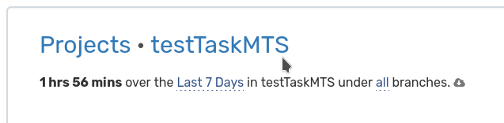

# Тестовое задание

<h3 align="left">🛠 Задача: </h3>

Необходимо разработать программный модуль на языке python, который с сайта kinopoisk.ru соберет список 1000 наиболее популярных фильмов, пометив те из них, 
которые доступны для просмотра в кинотеатре кинопоиск.
Результат работы модуля – json файл, содержащий список для каждого из которых в словаре указаны: название, позиция в рейтинге, 
возможность просмотра в кинотеатре.
Нужно постараться сделать потратив не более 2-3 часов.

<h3 align="left">⏱️ Что по времени? </h3>
Вот пруф с вакатайма:

<h3></h3>

<h3 align="left">🤔 P.S. </h3>
В Кинопоиске видимо не очень любят сторонних ботов (уж слишком часто они их блокируют), так что лучше всего передавать свои куки в headers.
Также можно было использовать библиотеки BeautifulSoup и lxml, но мне хотелось сделать решение без использования чего-либо кроме requests и time.
В целом мне очень понравилось, единственный минус - теперь я обиделся на Яндекс (да-да, GitHub, LeetCode, Osu! и Vk ни разу не блокировали мои проекты).
